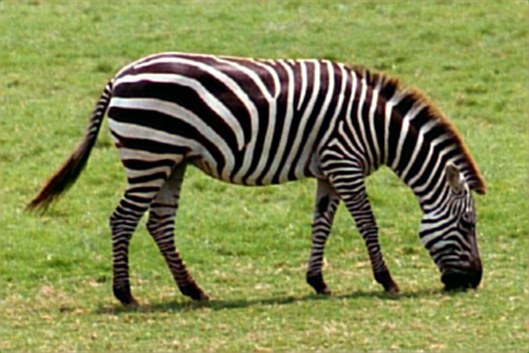

# Image Super-Resolution Using Convolutional Neural Networks

This is an implementation of [SRCNN](https://arxiv.org/abs/1501.00092) using PyTorch and OpenCV.


-----

## Download Datasets

Contains DIV2K, DIV8K, Flickr2K, OST, T91, Set5, Set14, BSDS100 and BSDS200, etc.

- [Data](https://drive.google.com/drive/folders/1A6lzGeQrFMxPqJehK9s37ce-tPDj20mD?usp=sharing)


## Preprocessing

Each dataset is saved in a hdf5 file with a specific upscale factor. I use the OpenCV library - [cv2.INTER_CUBIC] interpolation instead of PIL library.

To run we need to specify which dataset we want to use, patch size, stride, upscale factor etc.

Example

```
./preprocessing.py --dataset=T91 --output-path=T91
                   --patch-size=33 --stride=14 --upscale-factor=3
                   --validation=False
```

## Train and Test

Dataset converted to HDF5 are used in the training and evaluation part. For training T91 dataset is used, as for validation dataset Set14 is used.
Create a models directory to save the models.

Train Example

```
./train.py --model-path=models --train-dataset=T91 --validation-dataset=Set14
           --upscale-factor=3 --learning-rate=1e-4 --batch-size=16 --num-epochs=1000  
```


-----

Test Example

```
./test.py --weights=demo/101573_210.pth --image-file=demo/zebra.bmp --upscale-factor=3
```


<table>
    <tr>
        <td><center>Original</center></td>
        <td><center>BICUBIC x3</center></td>
        <td><center>SRCNN x3</center></td>
    </tr>
    <tr>
    	<td>
    		<center></center>
    	</td>
    	<td>
    		<center></center>
    	</td>
    	<td>
    		<center></center>
    	</td>
    </tr>
</table>